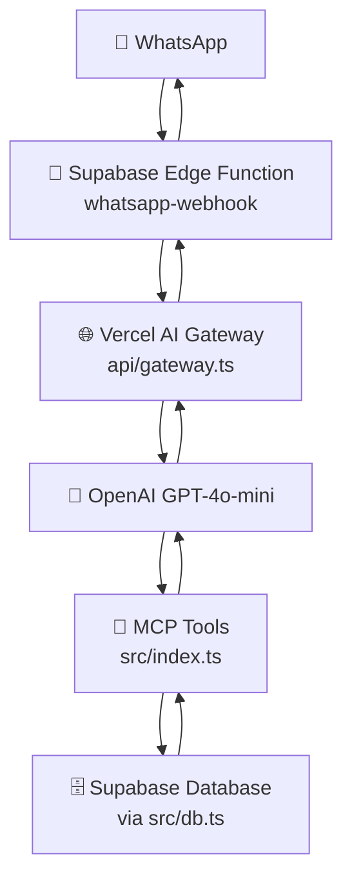

# 🍽️ Restaurant MCP - Sistema Unificado de Ferramentas para Restaurante

## 📋 Visão Geral

Este projeto implementa um **servidor MCP (Model Context Protocol) unificado** que expõe ferramentas de gestão de restaurante para dois ambientes:

1. **🖥️ Claude Desktop** - Para desenvolvimento e debugging interativo
2. **🤖 AI Gateway (Vercel)** - Para produção via WhatsApp Bot

**Filosofia**: **Uma única fonte de verdade** em `src/index.ts` que funciona em ambos os ambientes, eliminando duplicação de código e garantindo consistência.

---

## ⚠️ **IMPORTANTE: Como Funciona a Sincronização**

### 🎯 **Uma Ferramenta, Dois Ambientes**
Quando você adiciona uma ferramenta em `src/index.ts`, ela fica disponível para:
- ✅ **Claude Desktop** - lê diretamente de `src/index.ts` (TypeScript)
- ✅ **Produção (AI Gateway)** - lê de `dist/src/index.js` (JavaScript compilado)

### 🔄 **Fluxo de Atualização (CRÍTICO)**

**❌ NÃO é automático!** O arquivo compilado não se atualiza sozinho.

#### 📝 **Processo Correto:**
```bash
# 1. Edite src/index.ts (adicione/modifique ferramentas)
# 2. SEMPRE compile após mudanças:
npm run build

# 3. Teste localmente:
# - Claude Desktop: usa src/index.ts ✅  
# - Produção: usará dist/src/index.js ✅

# 4. Deploy:
git add -A
git commit -m "Nova ferramenta adicionada"
git push origin main
# Vercel rebuilda automaticamente
```

#### 🚨 **Se esquecer `npm run build`:**
- ✅ Claude Desktop funciona (lê `.ts` diretamente)
- ❌ Produção quebra (usa `.js` desatualizado)

#### ✅ **Verificação Rápida:**
```bash
# Confirme que sua nova ferramenta está compilada:
grep -n "nome_da_ferramenta" dist/src/index.js
```

---

## 🏗️ Arquitetura Completa

### 🔄 Fluxo de Dados - WhatsApp para Resposta



### 🎯 Componentes Principais

#### 1. **`src/index.ts`** - 🎯 FONTE ÚNICA DE VERDADE
- **Servidor MCP completo** com todas as ferramentas
- **Exporta `tools` e `toolHandlers`** para uso externo
- **Funciona com Claude Desktop** via protocolo MCP stdio
- **Funciona com AI Gateway** via imports diretos

#### 2. **`api/gateway.ts`** - 🌐 Gateway de Produção
- **Serverless Function (Vercel)** que recebe requisições HTTP
- **Importa ferramentas** de `../dist/src/index.js` (compilado)
- **Orquestra OpenAI** para decidir quais ferramentas chamar
- **Executa ferramentas diretamente** (sem child process)

#### 3. **`supabase/functions/whatsapp-webhook/`** - 📡 Entrada WhatsApp
- **Edge Function (Deno)** que recebe webhooks do WhatsApp
- **Encaminha mensagens** para o AI Gateway
- **Envia respostas** de volta via WhatsApp API

#### 4. **`src/db.ts`** - 🗄️ Camada de Dados
- **Wrappers Supabase** para todas as operações de banco
- **Funções RPC** tipadas e com tratamento de erro
- **Compartilhado** entre todas as ferramentas

---

## 🚀 Como Funciona na Prática

### 📱 Fluxo WhatsApp (Produção)

1. **Usuário envia**: `"kpi ontem"`
2. **WhatsApp webhook** recebe e encaminha para Gateway
3. **Gateway** chama OpenAI com ferramentas disponíveis
4. **OpenAI** decide chamar `get_daily_kpi_on_date`
5. **Gateway** executa ferramenta → Supabase → dados
6. **OpenAI** formata resposta em português
7. **Resposta** volta via WhatsApp: `"KPIs de 2025-01-05 — Vendas: R$ 12.500 • CMV: 32% • Labour: 28%"`

### 🖥️ Fluxo Claude Desktop (Desenvolvimento)

1. **Claude Desktop** conecta via `claude_desktop_config.json`
2. **MCP Server** (`src/index.ts`) inicia via stdio
3. **Claude** descobre ferramentas via `ListToolsRequest`
4. **Você pergunta**: `"Quais foram os KPIs de ontem?"`
5. **Claude** chama `get_daily_kpi_on_date` automaticamente
6. **Resposta estruturada** aparece no chat

---

## 🛠️ Configuração e Instalação

### 📋 Pré-requisitos

- **Node.js** >= 18
- **Conta Supabase** (URL + Service Role Key)
- **Conta OpenAI** (API Key) - para produção
- **Claude Desktop** - para desenvolvimento

### 🔧 Instalação

```bash
# Clone e instale dependências
git clone <seu-repo>
cd restaurant-mcp
npm install

# Configure variáveis de ambiente
cp .env.example .env
# Edite .env com suas credenciais
```

### 🌐 Variáveis de Ambiente

| Ambiente | Variável | Descrição | Exemplo |
|----------|----------|-----------|---------|
| **Todos** | `SUPABASE_URL` | URL do projeto Supabase | `https://xxx.supabase.co` |
| **Todos** | `SUPABASE_SERVICE_ROLE_KEY` | Chave service role | `eyJhbGciOiJIUzI1NiIs...` |
| **Gateway** | `OPENAI_API_KEY` | Chave da API OpenAI | `sk-proj-...` |
| **Gateway** | `OPENAI_MODEL` | Modelo OpenAI (opcional) | `gpt-4o-mini` |
| **Webhook** | `AI_GATEWAY_URL` | URL do Gateway Vercel | `https://seu-app.vercel.app/api/gateway` |
| **Webhook** | `AI_GATEWAY_TOKEN` | Token de autenticação | `x-gw-secret` |

---

## 🖥️ Configuração Claude Desktop

Adicione no `~/Library/Application Support/Claude/claude_desktop_config.json`:

```json
{
  "mcpServers": {
    "restaurant-mcp": {
      "command": "node",
      "args": ["/caminho/absoluto/para/restaurant-mcp/dist/src/index.js"],
      "env": {
        "SUPABASE_URL": "https://SEU_PROJETO.supabase.co",
        "SUPABASE_SERVICE_ROLE_KEY": "SUA_SERVICE_ROLE_KEY_AQUI"
      }
    }
  }
}
```

**⚠️ Importante**: 
- Use **caminho absoluto** para o arquivo compilado
- Execute `npm run build` antes de conectar
- Substitua as credenciais pelos valores reais

---

## 🔧 Ferramentas Disponíveis

### 📊 KPIs e Vendas

#### `get_daily_kpi`
- **Descrição**: KPIs resumidos de um dia (vendas, % food, % labour)
- **Parâmetros**: `owner_id` (UUID), `day` (YYYY-MM-DD)
- **Uso**: Visão geral rápida do dia

#### `get_daily_kpi_on_date`  
- **Descrição**: KPIs detalhados com custos absolutos
- **Parâmetros**: `owner_id` (UUID), `day` (YYYY-MM-DD)
- **Uso**: Análise detalhada de custos

#### `get_period_kpis`
- **Descrição**: KPIs agregados de um período
- **Parâmetros**: `owner_id` (UUID), `start` (YYYY-MM-DD), `end` (YYYY-MM-DD)
- **Uso**: Análise mensal/semanal

### 👥 Gestão de Pessoal

#### `get_shifts_range`
- **Descrição**: Horas trabalhadas por funcionário em um período
- **Parâmetros**: `owner_id` (UUID), `start` (YYYY-MM-DD), `end` (YYYY-MM-DD)
- **Uso**: Planejamento de escala

#### `get_employee_pay`
- **Descrição**: Detalhes de pagamento de um funcionário específico
- **Parâmetros**: `owner_id` (UUID), `emp_code` (string), `start` (YYYY-MM-DD), `end` (YYYY-MM-DD)
- **Uso**: Cálculo de folha de pagamento

### 📦 Operações e Compras

#### `get_orders_range`
- **Descrição**: Pedidos a fornecedores em um período
- **Parâmetros**: `owner_id` (UUID), `start` (YYYY-MM-DD), `end` (YYYY-MM-DD)
- **Uso**: Controle de estoque e custos

#### `get_notes_range`
- **Descrição**: Observações operacionais em um período
- **Parâmetros**: `owner_id` (UUID), `start` (YYYY-MM-DD), `end` (YYYY-MM-DD)
- **Uso**: Contexto operacional e insights

### 📅 Eventos e Lembretes

#### `add_event`
- **Descrição**: Cria evento/lembrete para o dono
- **Parâmetros**: `owner_id` (UUID), `date` (YYYY-MM-DD), `title` (string), `kind` (opcional), `time` (HH:MM, opcional), `notes` (opcional)
- **Uso**: Agendar manutenções, entregas, etc.

#### `get_events_range`
- **Descrição**: Lista eventos em um período
- **Parâmetros**: `owner_id` (UUID), `start` (YYYY-MM-DD), `end` (YYYY-MM-DD)
- **Uso**: Visualizar agenda

---

## 🧠 Sistema de IA e Prompts

### 🎯 System Prompt (Gateway)

O AI Gateway usa este system prompt para instruir o modelo:

```typescript
const system = `Você é um assistente que usa ferramentas MCP. Sempre inclua "owner_id":"${owner_id}" nos argumentos das ferramentas quando necessário. 

IMPORTANTE: Se uma ferramenta retornar "no_data: true", isso significa que não há dados para aquela data/período específico. NÃO continue tentando outras datas - em vez disso, forneça uma resposta útil explicando que não há dados disponíveis para o período solicitado.

Responda em pt-BR.`;
```

### 🔄 Controle de Ferramentas

- **`tool_choice: 'auto'`** - Permite que a IA decida quando chamar ferramentas vs. responder
- **Detecção de "no_data"** - Para evitar loops infinitos quando não há dados
- **Limite de 6 iterações** - Previne loops infinitos

---

## 🔍 Padrão de Resposta das Ferramentas

Todas as ferramentas seguem um padrão consistente:

### ✅ Resposta com Dados
```typescript
{
  content: [
    { type: "text", text: "KPIs de 2025-01-05 — Vendas: R$ 12.500 • CMV: 32% • Labour: 28%" },
    { type: "text", text: '{"day":"2025-01-05","net_sales":12500,"food_pct":0.32,"labour_pct":0.28}' }
  ],
  structuredContent: {
    day: "2025-01-05",
    net_sales: 12500,
    food_pct: 0.32,
    labour_pct: 0.28
  },
  isError: false
}
```

### ❌ Resposta Sem Dados
```typescript
{
  content: [
    { type: "text", text: "Sem dados para 2025-01-05." }
  ],
  structuredContent: { 
    no_data: true, 
    day: "2025-01-05", 
    message: "Sem dados para 2025-01-05." 
  },
  isError: false
}
```

### 🚨 Resposta com Erro
```typescript
{
  content: [
    { type: "text", text: "invalid day (YYYY-MM-DD)" }
  ],
  isError: true
}
```

---

## ➕ Como Adicionar Novas Ferramentas

### 1. 🗄️ Criar Wrapper no Banco (`src/db.ts`)

```typescript
export async function getNewFeature(ownerId: string, param: string) {
  const { data, error } = await sb.rpc("get_new_feature", { 
    p_owner: ownerId, 
    p_param: param 
  });
  if (error) throw new Error(error.message);
  return data;
}
```

### 2. 📝 Adicionar Schema de Ferramenta (`src/index.ts`)

No array `tools`:

```typescript
{
  name: "get_new_feature",
  description: "Descrição clara da nova funcionalidade",
  inputSchema: {
    type: "object",
    properties: {
      owner_id: { type: "string", description: "UUID do dono" },
      param: { type: "string", description: "Parâmetro específico" }
    },
    required: ["owner_id", "param"],
    additionalProperties: false
  }
}
```

### 3. 🔧 Implementar Handler (`src/index.ts`)

No objeto `toolHandlers`:

```typescript
get_new_feature: async ({ owner_id, param }) => {
  try {
    validateUUID(owner_id);
    if (!param || typeof param !== 'string') throw new Error("invalid param");
  } catch (e: any) {
    return { content: [{ type: "text", text: e?.message || "Invalid arguments" }], isError: true };
  }
  
  const data = await getNewFeature(owner_id, param);
  if (data == null || (typeof data === "object" && Object.keys(data).length === 0)) {
  return {
      content: [{ type: "text", text: `Sem dados para ${param}.` }], 
      structuredContent: { no_data: true, param, message: `Sem dados para ${param}.` },
    isError: false
    };
  }
  
  const safe = JSON.parse(JSON.stringify(data));
  const summary = `Nova funcionalidade para ${param}: ${safe.count} itens`;
  return render(safe, summary);
}
```

### 4. 🧪 Testar

```bash
# Compilar
npm run build

# Testar no Claude Desktop
# (reinicie o Claude Desktop para recarregar)

# Testar no Gateway
curl -X POST "https://seu-app.vercel.app/api/gateway" \
  -H "Content-Type: application/json" \
  -H "Authorization: Bearer x-gw-secret" \
  -d '{"owner_id":"uuid","from":"+5511999999999","text":"teste nova funcionalidade"}'
```

---

## 🚀 Deploy e Produção

### 📦 Build

```bash
npm run build
# Gera dist/ com arquivos compilados
```

### 🌐 Deploy Vercel

1. **Configure variáveis de ambiente** no Vercel Dashboard
2. **Push para GitHub** - deploy automático
3. **Configure webhook** no Supabase com URL do Gateway

### 🔧 Deploy Supabase Edge Functions

```bash
# Na pasta do projeto
supabase functions deploy whatsapp-webhook
supabase secrets set AI_GATEWAY_URL=https://seu-app.vercel.app/api/gateway
supabase secrets set AI_GATEWAY_TOKEN=x-gw-secret
```

---

## 🐛 Debug e Troubleshooting

### 📊 Logs Claude Desktop (macOS)
```bash
tail -f "$HOME/Library/Logs/Claude/mcp-server-restaurant-mcp.log"
```

### 📊 Logs Vercel
- Acesse Vercel Dashboard → Functions → View Logs
- Ou use `vercel logs` CLI

### 📊 Logs Supabase
- Acesse Supabase Dashboard → Edge Functions → Logs

### 🔍 Testes Manuais

```bash
# Teste direto do Gateway
curl -X POST "https://seu-app.vercel.app/api/gateway" \
  -H "Content-Type: application/json" \
  -H "Authorization: Bearer x-gw-secret" \
  -d '{"owner_id":"uuid","from":"+5511999999999","text":"kpi hoje"}'

# Health check
curl "https://seu-app.vercel.app/api/ping"
```

### ⚠️ Problemas Comuns

1. **Loop infinito de ferramentas**
   - **Causa**: `tool_choice: 'required'` força sempre chamar ferramentas
   - **Solução**: Use `tool_choice: 'auto'`

2. **"Not connected" errors**
   - **Causa**: Child process não funciona no Vercel
   - **Solução**: Use imports diretos (já implementado)

3. **Module not found**
   - **Causa**: Paths de import incorretos ou build não executado
   - **Solução**: Execute `npm run build` e verifique imports

---

## 🔐 Segurança

### 🔑 Chaves e Credenciais
- **Nunca** commite chaves no código
- Use **variáveis de ambiente** em todos os ambientes
- **Service Role Key** apenas para operações server-side seguras

### 🛡️ Autenticação
- **Gateway** protegido por token Bearer
- **WhatsApp** validado por owner_id mapping
- **Supabase** com Row Level Security (RLS)

### 🚨 Rate Limiting
- **OpenAI** tem rate limits nativos
- **Supabase** tem limites por plano
- Considere implementar cache para queries frequentes

---

## 🎯 Casos de Uso Práticos

### 📱 Via WhatsApp
- `"kpi ontem"` → KPIs do dia anterior
- `"vendas da semana"` → KPIs da semana atual
- `"horas do João em janeiro"` → Relatório de funcionário
- `"criar lembrete manutenção geladeira amanhã 14h"` → Adiciona evento

### 🖥️ Via Claude Desktop
- Análises complexas com múltiplas ferramentas
- Debugging de dados específicos
- Desenvolvimento de novas consultas
- Validação de lógica de negócio

---

## 🛣️ Roadmap

### 🎯 Curto Prazo
- [ ] Mais validações de entrada
- [ ] Cache de queries frequentes
- [ ] Métricas e monitoring
- [ ] Testes automatizados

### 🚀 Médio Prazo
- [ ] Dashboard web para visualização
- [ ] Integração com mais canais (Telegram, Slack)
- [ ] Relatórios automatizados
- [ ] Alertas proativos

### 🌟 Longo Prazo
- [ ] Machine Learning para insights preditivos
- [ ] Integração com ERPs
- [ ] API pública para terceiros
- [ ] Multi-tenant para múltiplos restaurantes

---

## 🤝 Contribuindo

1. **Fork** o repositório
2. **Crie branch** para sua feature: `git checkout -b feature/nova-funcionalidade`
3. **Commit** suas mudanças: `git commit -m 'Adiciona nova funcionalidade'`
4. **Push** para a branch: `git push origin feature/nova-funcionalidade`
5. **Abra Pull Request**

---

## 📄 Licença

Este projeto está sob a licença MIT. Veja o arquivo `LICENSE` para detalhes.

---

## 🆘 Suporte

- **Issues**: Use GitHub Issues para bugs e feature requests
- **Documentação**: Este README é a fonte principal
- **Debug**: Siga as seções de troubleshooting acima

---

**🎉 Agora você tem um sistema completo de MCP unificado funcionando tanto no Claude Desktop quanto em produção via WhatsApp!**

---

## 📚 Guias (Condensado)

### 🔔 Closing Reminder (Resumo)
- Banco (migration `20250115_closing_reminder.sql`):
  - `owners`: `manager_phone_e164`, `closing_time` (padrão 21:30), `closing_reminder_enabled` (bool)
  - Nova tabela `pending_sales_input` para rastrear lembretes e respostas (índice por `manager_phone`, `status`)
- Funções Edge:
  - `closing-reminder`: roda via cron ou manual; seleciona donos com `closing_reminder_enabled` e telefone do gerente; aplica janela de 5 min no fuso do dono; cria `pending_sales_input`; envia template WhatsApp; loga em `delivery_logs`.
  - `process-sales-input`: recebe texto do gerente, extrai valor (formatações BR/US), atualiza `pending_sales_input` para `completed`, insere em `form_submissions`, responde confirmação com resumo do mês.
- Webhook (`whatsapp-webhook`): se houver `pending_sales_input` pendente para o `manager_phone`, roteia para `process-sales-input` (não passa pelo bot/IA).
- Variáveis de ambiente relevantes:
  - `SUPABASE_URL`, `SUPABASE_SERVICE_ROLE_KEY`, `WHATSAPP_PHONE_ID`, `META_TOKEN`, `META_GRAPH_VERSION`
  - `WABA_CLOSING_TEMPLATE` (ex.: `closing_reminder`), `WABA_LANG` (ex.: `pt_BR`)
  - `WABA_TEMPLATE_HAS_VARS` (`true|false`) — quando `false`, envia o template sem parâmetros (para corpo simples como "Olá, quanto vendeu hoje?")
- Cron (exemplo a cada 30 min):
```sql
SELECT cron.schedule(
  'closing-reminder',
  '*/30 * * * *',
  $$ SELECT net.http_post(
       url := 'https://<proj>.supabase.co/functions/v1/closing-reminder',
       headers := jsonb_build_object('Authorization','Bearer <SERVICE_ROLE>')
     ); $$
);
```
- Teste manual:
```bash
curl -X POST \
  "https://<proj>.supabase.co/functions/v1/closing-reminder?owner_id=<OWNER_ID>&force=true" \
  -H "Authorization: Bearer <KEY>"
```
- Fluxo diário (resumo): cron → seleciona donos elegíveis → cria `pending_sales_input` → envia WhatsApp → gerente responde → webhook detecta pendência → `process-sales-input` grava e confirma.

### 🧰 Multitenancy (Resumo)
1) Aplicar migrations: `supabase db push`
2) Deploy functions: `supabase functions deploy generate-owner-links` e `ingest-form`
3) Capturar IDs dos outros formulários (Custos, Mão de Obra) e campos `entry.*`
4) Atualizar `form_config` com `form_id` e `token_entry_id`
5) Testar geração de links (POST `generate-owner-links`) e usar token oculto nos formulários (Apps Script envia `owner_token` junto ao payload)
6) Testar ponta-a-ponta: gerar link → preencher → dados chegam em `form_submissions` relacionados ao owner correto

### 🎬 Roteiro de Demonstração (Resumo)
- Objetivo: fechar 3–5 restaurantes com teste de 30 dias
- Antes: WhatsApp do bot ok, dashboard com `OWNER_ID`, formulários prontos
- Demonstração:
  - Parte 1 (WhatsApp): perguntas rápidas (ontem, semana, CMV)
  - Parte 2 (Lançamento): preencher vendas em formulário
  - Parte 3 (Dashboard): atualizar e mostrar KPIs do dia/mês
- Oferta: 30 dias grátis, configuração e suporte inclusos, depois R$ 97/mês

Para detalhes completos, veja os documentos: `CLOSING_REMINDER_IMPLEMENTATION.md`, `MULTITENANCY_GUIDE.md`, `DEMO_SCRIPT_FRIDAY.md`.